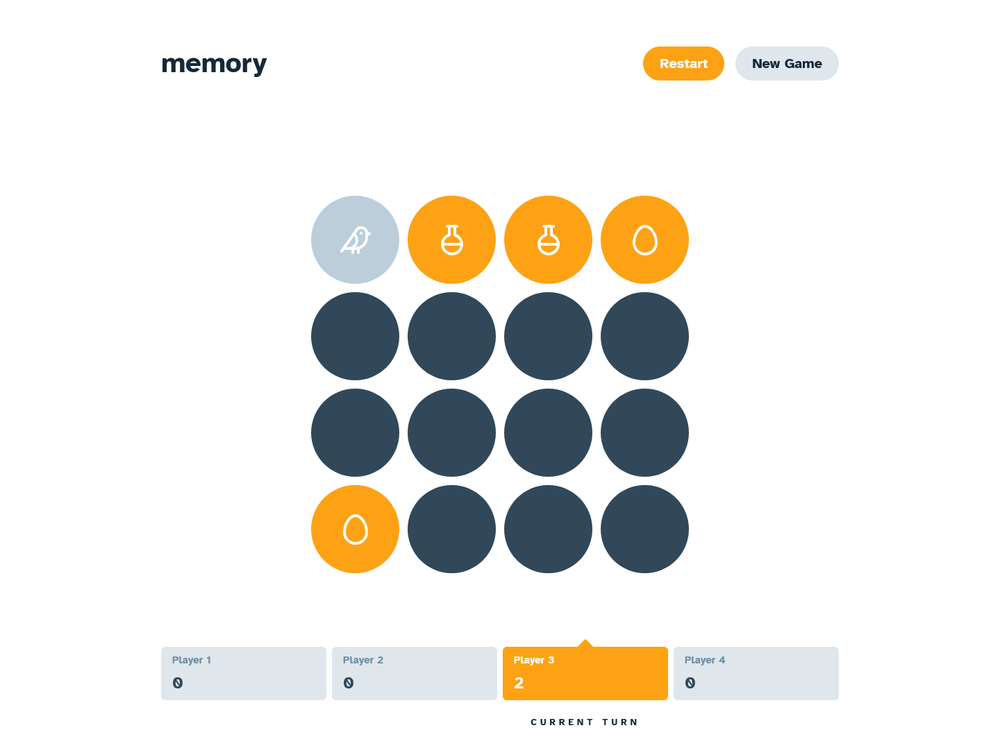
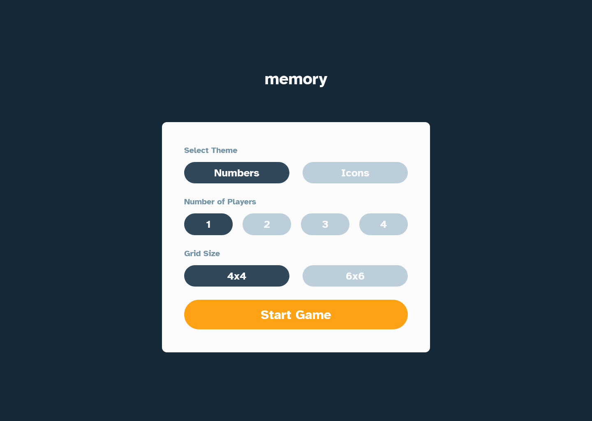
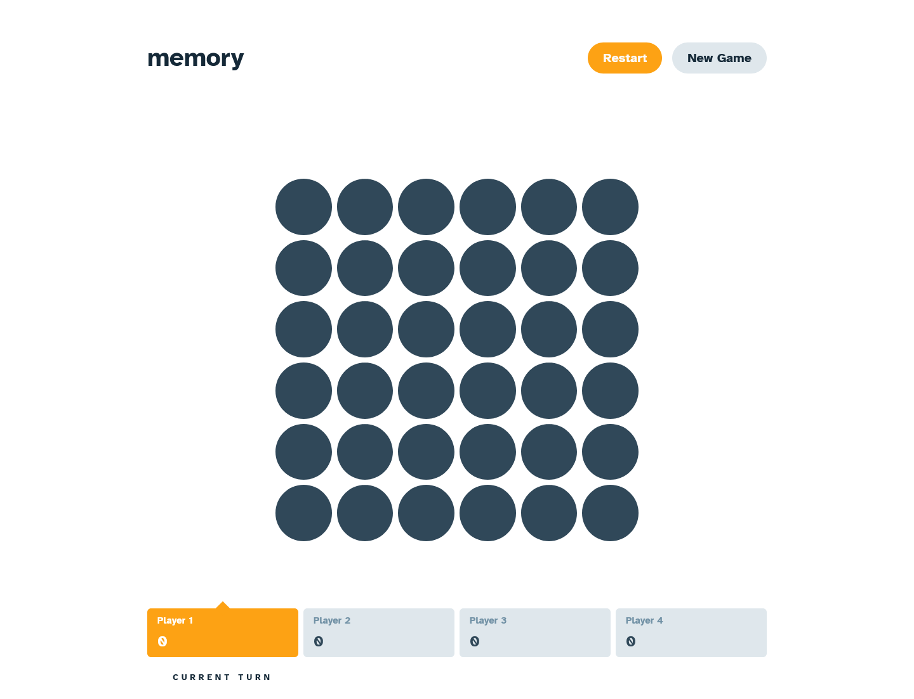
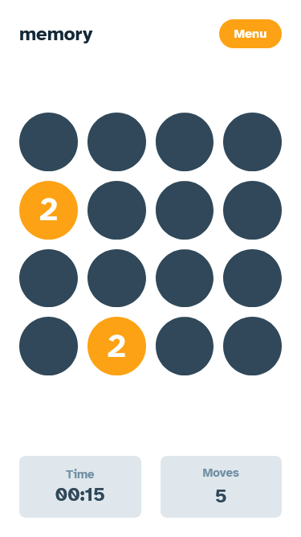
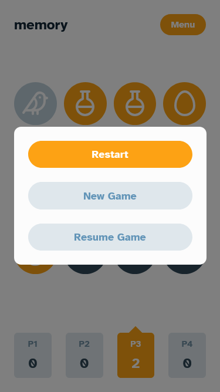

# Frontend Mentor - Memory Game 🧠

[](https://reactjs.org/)
[](https://reactrouter.com/)
[](https://vitejs.dev/)
[](https://tailwindcss.com/)
[](https://www.typescriptlang.org/)
[](https://github.com/pmndrs/zustand)
[](https://lucide.dev/)



### 🌐 Live Demo:

**[View live site →](https://front-end-mentor-memory-game.vercel.app/)**

Deployed on Vercel with HTTPS and performance optimizations.

---

This is a solution to the [Memory Game challenge on Frontend Mentor](https://www.frontendmentor.io/challenges/memory-game-vse4WFPvM). Frontend Mentor challenges help you improve your coding skills by building realistic projects.

## Table of contents

- [Overview](#overview)
  - [The challenge](#the-challenge)
  - [Screenshot](#screenshot)
  - [Links](#links)
- [My process](#my-process)
  - [Built with](#built-with)
  - [What I learned](#what-i-learned)
  - [Continued development](#continued-development)
- [Author](#author)
- [Acknowledgments](#acknowledgments)

## Overview

### The challenge

Users should be able to:

- View the optimal layout for the game depending on their device's screen size
- See hover states for all interactive elements on the page
- Play the Memory game either solo or multiplayer (up to 4 players)
- Set the theme to use numbers or icons within the tiles
- Choose to play on either a 4x4 or 6x6 grid

### Screenshot

<table>
  <tr>
    <td></td>
    <td></td>
  </tr>
  <tr>
    <td></td>
    <td></td>
  </tr>
</table>

### Links

- Solution URL: [GitHub Repository](https://github.com/TomSif/Front-end_Mentor_Memory-Game)
- Live Site URL: [Vercel Deployment](https://front-end-mentor-memory-game.vercel.app/)

## My process

### Built with

- Semantic HTML5 markup (native `<dialog>` for modals, `<fieldset>` + `<legend>` for radio groups)
- Mobile-first workflow
- [React 19](https://react.dev/) - JS library
- [React Router v7](https://reactrouter.com/) - Client-side routing
- [TypeScript](https://www.typescriptlang.org/)
- [Vite](https://vitejs.dev/) - Build tool
- [Tailwind CSS v4](https://tailwindcss.com/) - Utility-first CSS (`@theme` variables, `@utility` presets, arbitrary `transition-[background-color]`)
- [Zustand](https://github.com/pmndrs/zustand) - State management with `persist` middleware (`partialize`, `migrate`, versioned schema)
- [Lucide React](https://lucide.dev/) - Icon library for the icons theme
- [clsx](https://github.com/lukeed/clsx) + [tailwind-merge](https://github.com/dcastil/tailwind-merge) — `cn()` utility for conditional classNames
- React `ErrorBoundary` (class component) - Render-error safety net around `GameBoard`

### What I learned

#### Zustand store architecture — single source of truth + `persist`

The architectural backbone of this project is a single Zustand store that owns `gameConfig`, `tiles`, `flippedIds`, `phase`, `timeElapsed`, `isRunning`, `currentPlayerIndex`, `scores`, and all the actions that mutate them. `StartScreen` writes the config; `GameBoard` reads from the store. React Router stays a pure navigation primitive — no state-passing through `location.state`.

```ts
// Consumed safely from any component
const { tiles, flippedIds, phase, flipTile, resetGame } = useGameStore();
```

The `persist` middleware required deliberate `partialize` configuration: actions can't be serialised, and `isRunning` must be forced to `false` on rehydration (otherwise the timer would resurrect itself on refresh without any `setInterval` actually running). A `version + migrate` pair was added later to handle stale localStorage states gracefully when the schema evolved:

```ts
persist(storeConfig, {
  name: "memory-game",
  version: 1,
  partialize: (state) => ({
    gameConfig: state.gameConfig,
    tiles: state.tiles,
    flippedIds: state.flippedIds,
    phase: state.phase,
    timeElapsed: state.timeElapsed,
    isRunning: false, // never persist a running timer
    moves: state.moves,
    scores: state.scores,
    currentPlayerIndex: state.currentPlayerIndex,
  }),
  migrate: (persistedState, version) => {
    if (version < 1) return { ...persistedState, phase: "setup", tiles: [] };
    return persistedState;
  },
});
```

#### `setTimeout` race condition — storing the timeout ref in the store

When two non-matching tiles are flipped, they flip back after a 1-second delay via `setTimeout`. A bug surfaced during the final audit: if the user clicks Restart or New Game mid-delay, the orphan timeout fires on the new game's state and overwrites `currentPlayerIndex` and `flippedIds`. The fix is to store the timeout reference in the store and cancel it on every reset path:

```ts
// In the store
flipBackTimeout: null as ReturnType<typeof setTimeout> | null,

checkMatch: () => {
  // ... mismatch branch
  const id = setTimeout(() => set({ flippedIds: [] }), FLIP_BACK_DELAY_MS);
  set({ flipBackTimeout: id });
},

startGame: () => {
  const { flipBackTimeout } = get();
  if (flipBackTimeout) clearTimeout(flipBackTimeout);
  // ... rest of reset
},
```

Two TypeScript notions surfaced in passing: `ReturnType<typeof setTimeout>` (adaptive across Node and browser environments), and the symmetry between `clearInterval` and `clearTimeout` — a stored timeout is just a number you have to remember to invalidate.

#### Native `<dialog>` + Escape key state sync

The `<dialog>` element was chosen deliberately for the free a11y it provides: focus trap, backdrop, `showModal()` / `close()` semantics. But native Escape behaviour creates a subtle desync — the dialog closes natively without telling React, so the parent's `isOpen` stays `true`, and the next render re-calls `showModal()`. The fix is to intercept `onCancel` and route the close through React state:

```tsx
<dialog
  ref={dialogRef}
  aria-modal="true"
  aria-labelledby="menuModalTitle"
  onCancel={(e) => {
    e.preventDefault();
    onResume();
  }}
>
  <h2 id="menuModalTitle">Menu</h2>
  {/* ... */}
</dialog>
```

Two non-obvious points emerged from the same pass:

- `aria-labelledby` must reference the `id` of the title element, not the dialog itself — the initial reflex was to point it at the dialog's own `id`.
- A `<dialog>` is always mounted in React even when hidden — `display:none` is HTML-level, not React-level. Applying `flex` directly to `<dialog>` overrides the native `display:none` and breaks the hidden state entirely. The fix was to delegate layout to a wrapper `<div>`.

#### Deriving state vs storing it — `flippedIds` over `isFlipped`

Early in the project each `Tile` carried its own `isFlipped` boolean alongside the global `flippedIds` array in the store — two parallel sources of truth for the same fact. A refactor collapsed this: `isFlipped` is derived at render time from `flippedIds.includes(id)`, and `flipTile` no longer mutates the tiles array to mark one as flipped.

```ts
// Before — duplicated state, mutation needed on every flip
type Tile = {
  id: string;
  value: TileValue;
  isFlipped: boolean;
  isMatched: boolean;
};

// After — derive at render, single source of truth
type Tile = { id: string; value: TileValue; isMatched: boolean };
const isFlipped = flippedIds.includes(tile.id) || tile.isMatched;
```

The win is in the surface area of state changes: `flipTile` becomes an append to `flippedIds`. Mismatches reset with `flippedIds: []`. Matches mutate the tiles array exactly once, to set `isMatched`. Whole categories of "the two booleans disagree" bugs disappear because there is no longer a second boolean to disagree.

#### `useMemo` — questioning the reflex

A `useMemo` was wrapping a `.sort()` on the players' scores, with `[unRankedScore]` as the dependency. The audit caught it: `unRankedScore` is rebuilt on every render → its reference is always new → the memo is invalidated on every render → the sort runs every time anyway, with extra `useMemo` ceremony for zero benefit.

```ts
// Useless useMemo — dependency is a new reference every render
const rankedPlayers = useMemo(
  () => [...unRankedScore].sort((a, b) => b.score - a.score),
  [unRankedScore], // ← new array reference every render
);

// Honest version — calculate only when the result is consumed
const rankedPlayers =
  phase === "game-over"
    ? [...unRankedScore].sort((a, b) => b.score - a.score)
    : [];
```

The deeper lesson: `useMemo` is the wrong tool when the input itself is unstable. A conditional calculation — only when the result will actually be read — is both cheaper and more honest about intent. The audit's own proposed fix was to correct the dependency; the conditional approach beat it.

### Continued development

- **`useMemo` reflex** — adding it before checking whether its dependencies are even stable across renders. The audit caught one that ran on every render anyway. The next reflex to install is pausing on every `useMemo` to ask: is this dependency a reference that survives renders, or am I memoising into the void?
- **`set` Zustand syntax — `set(state => { ... return {...} })` vs `set(state => ({...}))`** — the distinction between an arrow function with a block body (needs an explicit `return`) and an arrow function returning a parenthesised object literal is still a recurring stumble inside multi-line Zustand actions.
- **Variable capture vs `get()` in real time** — inside `setTimeout` or async callbacks, a destructured value from `get()` is captured at call time. Reading the _live_ state at the moment the callback fires requires calling `get()` again from inside the callback. Subtle, and the bug is invisible until the state has changed between schedule and execution.
- **`<dialog>` mounted vs visible** — `<dialog>` toggled via `showModal()` / `close()` only controls visibility; the React component is always mounted, and any JS inside it keeps running. This generalises to tooltips, drawers, popovers — anything where "closed" doesn't mean "unmounted".

## Author

- Frontend Mentor - [@TomSif](https://www.frontendmentor.io/profile/TomSif)
- GitHub - [@TomSif](https://github.com/TomSif)

## Acknowledgments

This project was built with AI-assisted mentoring (Claude). The approach: I code by hand, Claude acts as a Socratic mentor — asking questions, explaining concepts, reviewing my reasoning. Architectural decisions (Zustand vs `useReducer`, what belongs in the store, when to derive vs store) stayed mine.

Specific AI contributions are documented transparently in my [progression log](./progression.md):

- **Written by Claude:** the external audit document (3 blockers + 7 code quality items + minor fixes) used as the starting point for refactoring sessions; the "why classes only" explanation for `ErrorBoundary` mechanics
- **My initiative:** the `useMemo` conditional-calculation fix (better than the audit's own proposed dependency correction); autonomous extraction of `Tile`, `Header`, `FooterSolo`, `FooterMulti` from a 260-line `GameBoard` (down to 156); deliberate choice of native `<dialog>` for free a11y over a custom modal; diagnosing the timer-survives-restart bug from `isRunning` not resetting; the responsive multi-player cards in pure CSS (no `useWindowSize`)
- **Collaborative:** the `checkMatch` race condition walked through step by step; the source-of-truth refactor removing `isFlipped` from the tile type; the `persist` middleware syntax (extracted into a `storeConfig: StateCreator<GameStore>` variable for readability); the focus-trap diagnosis on modals (`flex` overriding native `display:none`)
